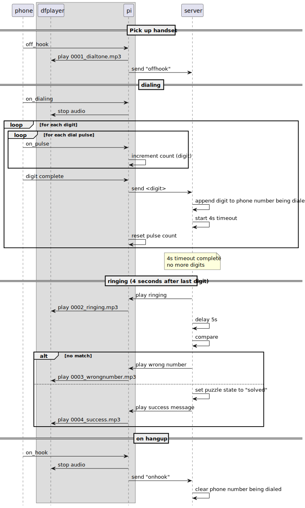

# Rotary Phone Puzzle

# Scenario
1. Player picks up the phone, and dials a number (determined by clues)
2. If the number is correct, the puzzle is solved, code is read out to player over phone speaker.
3. Alternatively, RPI could trigger other event such as unlocking a box 

## 📝 TODO
* Record individual digits as mp3s
* Improve Server flow to be more like an IVR

## Equipment
* Rotary Phone
* [MP3 Player on a chip](https://www.dfrobot.com/product-1121.html)
* Raspberry PI zero or something with network, GPIO and Serial

## Phone Prep
1. Gut the phone.
2. Replace the 4-wire cable with an 8-wire ethernet.  Tech on the outside allows for easier access and less risk when the phone takes a dive.
3. Connect phone bits to wire.

**Example phone wiring**

| Phone                  | Wire   | Pins                   |
|------------------------|--------|------------------------|
| Speaker +              | Red    | DFPlayer: Pin 8, SPK 1 |
| Speaker -              | Green  | DFPlayer: Pin 6, SPK 2 |
| Common to all switches | Black  | GND                    |
| Hook Switch            | Yellow | PI: PIN 18             |
| Dialer Switch          | Grey   | PI: PIN 23             |
| Pulse Switch           | Brown  | PI: PIN 24             |

**DF Player and PI wiring**

| DFPlayer   | PI        |
|------------|-----------|
| VCC PIN 1  | 5V        | 
| GND PIN 7  | GND       |
| RX PIN 2   | TX PIN 14 |
| TX PIN 3   | RX PIN 15 |

## Flow

